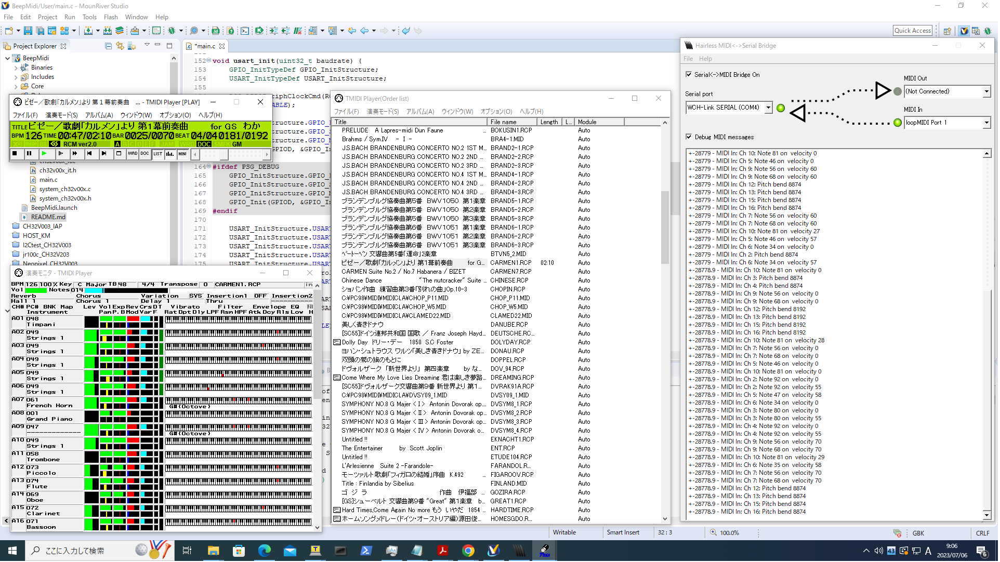

# BeepMIDI player for CH32V003/203

CH32V003/203 用の BEEP 音を使った MIDI 音源です。
MIDI CH10 以外の音を先着順に12音まで(203なら36音)発声できます。
(CH10 は GM ではドラムなので…)

## 使い方
シリアルポートを使う場合は、何らかの USB-Serial ブリッジ(みんな持ってる WCH-LinkE でOK)を経由して、
USART1 の RX である PD6 (203なら PA11)につなぎます。
Windows から鳴らす場合は LoopMidi と Hairless MIDI-Serial Bride を使えば、任意の MIDI プレイヤーの出力を流すことができます。 

シリアルポートのビットレートを 31250 にして、適当な MIDI 入力回路(市販の Arduino用 MIDI Hatなど)を使えば、
本物の MIDI からデータをもらうこともできます。 

音声は PC4 に PWM で出力されますので、適当なフィルタをかませて、ライン入力などにつなぎます。
そのまま圧電ブザーなどにつないでもOKです 

203の場合は複数の PWM (TIM2CH1~CH4)に分散して出力できるようになっています、標準では PA3 (CH4)と PA2 (CH3)を使っています 

内部オシレータを使う場合は、クロックの設定が 48MHz HSI (203の場合 144MHz HSI)になっていることを確認してください。 
CH32V003 の 8 ピン版でも使えるようにしているつもりですが、使えないピンがありましたら変更してください。 

## 解説
シリアルポートの入力は DMA を Circular モードで使っています。
WCH のサンプルにあるポーリング制御では、大量のデータ取りこぼしが発生したので悩んでいたのですが、
STM32 ならこうするという話が Web 上にたくさんありましたので、参考にしました。 

発音の方は、各CH ごとに矩形波を生成して、合成してるだけです。
合成した結果を約 190kHz (=SystemCoreClock/256) の PWM で 256階調で出力しています。
203 の場合 TIM1 と USART1 のピンが被るので、TIM2 を使っています 

以前の版では対数ボリュームにしていましたが、線形ボリュームに変更しました。 

## 制限事項
- MIDI のメッセージは、ごく一部しか解釈していません。
- MIDI ファイルによってはうまく再生できないものもあります